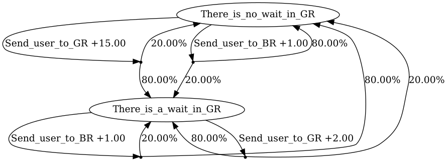

# Reinforcement Learning with Algorithms from Probabilistic Structure Estimation (RLAPSE)

In many reinforcement learning settings, the choice of the underlying algorithm is not obvious.
The RLAPSE framework provides the choice whether to use a lightweight myopic algorithm (e.g., Q-learning 
with discount factor 0) or more complicated (e.g., Q-learning with discount 
factor close to 1) reinforcement learning algorithm. The framework utilizes 
(i) the likelihood ratio test, and (ii) a variant of Q-learning analyzed by 
[(Even-Dar et al. 2003)](https://www.jmlr.org/papers/volume5/evendar03a/evendar03a.pdf)). 
Based on the collected statistics about the environment, the RLAPSE orchestrator switches to a more 
appropriate algorithm, if deemed necessary. This selection algorithm is called the *orchestrator*.
More details about this work can be found in [(Epperlein et al. 2021)](https://www.researchgate.net/publication/350087449_Reinforcement_Learning_with_Algorithms_from_Probabilistic_Structure_Estimation).

## Motivation

Consider a simple illustrative example for restaurant recommendation.
We have a good restaurant (*GR*) with very limited capacity, and a bad restaurant (*BR*) with near 
infinite capacity. Every time a user asks for a recommendation, we can send them to either of the 
two restaurants, hence our action space is 
, where 
* Action 1: Send user to *GR*;
* Action 2: Send user to *BR*.

*BR* is always able to seat customers, whereas *GR* might not be able to, hence we need at least 
two states, so the state space is 
, where 
* State 1: There is no wait in *GR*;
* State 2: There is a wait in *GR*.

Even when they have to wait, customers still prefer *GR*. Customers' enjoyment of *BR* is always 
the same, since they never have to wait there. So we can say that we have rewards 
, where
* : 
reward for sending customer to *GR* while there is no wait;
* : 
reward for sending customer to *GR* even if there is a wait;
* : 
reward for sending customer to *BR*.

Sending a customer to *GR* while it is able to seat will, with high probability, say 
, lead to 
a crowded *GR*. If there was a wait already, then sending a customer there will also likely 
not change that, so say the probability of *GR* staying crowded is 
.
Not sending a customer there will likely leave *GR* without a wait, with probability 
, or lead to 
*GR* being able to seat the next customer, with probability 
. 
For simplicity and illustrative purposes, we assume now that all the small probabilities are equal, i.e.,
.

This can be modeled as an MDP with transition probabilities 
 and reward 
. The probabilities to move from state 
 to state 
, i.e., 
 
for each action are encoded in the transition probability matrices:

* If recommending GR, i.e.,
, then transition matrix


* If recommending BR, i.e.,
, then transition matrix


The rewards for each state-action pair are 


The analysis provided in 
[(Epperlein et al. 2021)](https://www.researchgate.net/publication/350087449_Reinforcement_Learning_with_Algorithms_from_Probabilistic_Structure_Estimation)
can be used to show that for 

the myopic policy is optimal, and thus a simple lightweight algorithm would be more suitable for this 
problem. However, the value of 
 might be unknown from the outset, and 
sometimes more complicated algorithms can be required. RLAPSE is a tool which automatically selects 
the appropriate algorithm given an unknown environment.

**Note:** even though the restaurant example is not practical, this toy example is intended to
be a good illustration of the problem settings. A more realistic and complicated scenarios, the broker
example, is discussed in 
[(Epperlein et al.
2021)](https://www.researchgate.net/publication/350087449_Reinforcement_Learning_with_Algorithms_from_Probabilistic_Structure_Estimation).

## Getting Started
Please follow these instructions to install all the requirements and use the package correctly.

### Requirements and Installation
```bash
git clone https://github.com/roman1e2f5p8s/rlapseingym
```
If using `pip` use 
```bash
pip3.6 install -r requirements.txt
```
and for conda use
```bash
conda env create -f environment.yml  #  this will create the environment "rlapse"
```
to install the dependencies. Then run
```bash
python3.6 setup.py install
```

You may want to run the tests to make sure the software is fully compatible with your system:
```bash
python3.6 setup.py pytest
```
### Usage
RLAPSE includes three packages:
* `mdps`: provides wrappers for some MDP examples with ability to convert them into OpenAI environments;
* `algorithms`: implements reinforcement learning algorithms and the orchestrator;
* `utils`: includes some utilities to compute properties of infinite horizon MDPs and wrapper for 
[NumPy distributions](https://numpy.org/doc/1.16/reference/routines.random.html).

#### MDP examples
The following MDP examples are available in `rlapse.mdps.mdp`:
* `MDP`: create MDPs from transition probability tensor and reward matrix;
* `RandomMDP`: generate random MDPs using NumPy distributions.
* `RestaurantMDP`: create MDPs for the restaurant example;
* `BrokerMDP`: generate random MDPs for the broker example;
* `ToyBrokerMDP`: create MDPs for a toy broker example.

```python
from rlapse.mdps.mdp import RestaurantMDP

mdp = RestaurantMDP(epsilon=0.2)
mdp.validate()
```

##### Gym environments
Generated MDPs can be easily converted to OpenAI Gym environments:
```python
env = mdp.to_env()
```

The environment then can be rendered into Jupyter notebooks:
```python
env.render()
```

<div>

</div>
<b>Figure 1: Restaurant example MDP rendered into Jupyter notebook</b>

#### Algorithms
The package includes implementation of the Q-learning and RLAPSE algorithms:
```python
from rlapse.algorithms.qlearning import Qlearner
from rlapse.algorithms.rlapse import RLAPSE

a0 = Qlearner(env, gamma=0.0)          # Q-learning with discount factor 0.0
a1 = Qlearner(env, gamma=0.9)          # Q-learning with discount factor 0.9
rl = RLAPSE(env, a0, a1, t_start=100)  # RLAPSE
```

To learn a policy from the environment:
```python
a0.learn(total_timesteps=T)
a1.learn(total_timesteps=T)
rl.learn(total_timesteps=T)
```

To predict the action for a given observation (i.e., state):
```python
for observation in env.mdp.states:
    action_a0, _ = a0.predict(observation)
    action_a1, _ = a1.predict(observation)
    action_rl, _ = rl.predict(observation)
```

#### Utilities
Use the value iteration algorithm to compute the optimal policy:
```python
from rlapse.utils.infhmdp import ValueIteration, expected_reward

VI = ValueIteration(R=env.mdp.R, P=env.mdp.P)
OPTIMAL_POLICY = VI.policy
OPTIMAL_REWARD = expected_reward(R=env.mdp.R, P=env.mdp.P, policy=OPTIMAL_POLICY)
```

##### Distributions for random MDPs
Use the `Distribution` wrapper to generate random MDPs:
```python
import numpy as np
from rlapse.utils.distribution import Distribution
from rlapse.mdps.mdp import RandomMDP

P_distribution = Distribution(np.random.gamma, shape=1.0, scale=5.0)
R_distribution = Distribution(np.random.gamma, shape=0.1, scale=5.0)
mdp = RandomMDP(
        n_states=10, n_actions=3,
        controlled=False, rank1pages=True,
        P_distribution=P_distribution,
        R_distribution=R_distribution)
mdp.validate()
```

For more examples, please see the `examples/` folder and `examples.ipynb` notebook.

## Built With
* [MDP for OpenAI Gym](https://github.com/BlackHC/mdp)

## Authors
* **Roman Overko**

## Contributing
Pull requests are welcome. For major changes, please open an issue first to discuss what you would 
like to change.

Please make sure to update tests as appropriate.

## License
None
